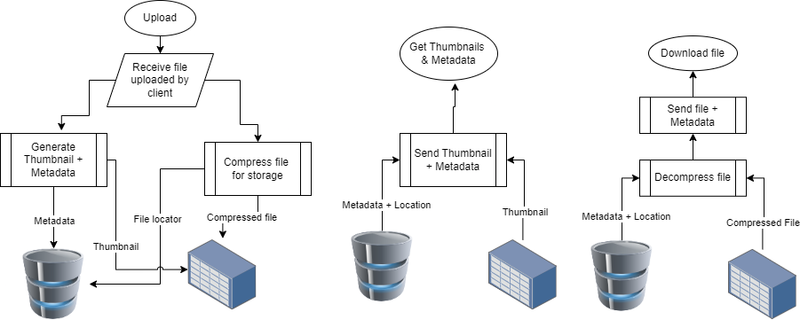

### Basic requirements:

- Upload a file
- Retrieve a file (metadata + thumbnail)
- Download a file
- Optimized storage (Compression)
- Organise files in folder structure

### Enhanced features

- Bulk export in a highly compressed format
- Bulk import from a highly compressed format
- Retrieve different file versions

The above features can be ensured by saving a snapshot of the DB and folder structure in a highly compressed file, and uploading it to a S3 bucket (preferred Glacier or similar archive storage due to low reads).
